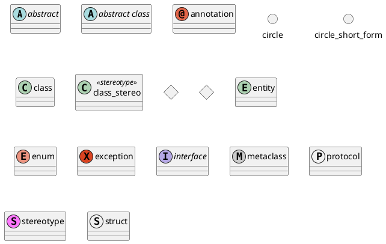
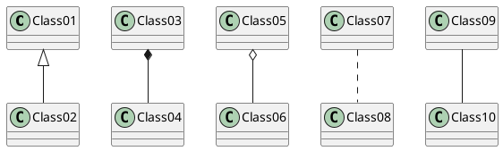
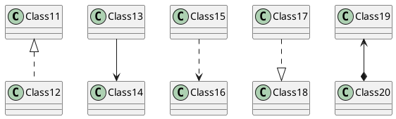
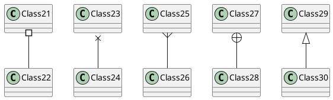
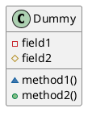
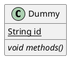
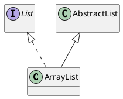

#plantUML

# Class diagram
> https://plantuml.com/class-diagram
## Declaring element

```plantUML
@startuml
abstract        abstract
abstract class  "abstract class"
annotation      annotation
circle          circle
()              circle_short_form
class           class
class           class_stereo  <<stereotype>>
diamond         diamond
<>              diamond_short_form
entity          entity
enum            enum
exception       exception
interface       interface
metaclass       metaclass
protocol        protocol
stereotype      stereotype
struct          struct
@enduml
```


## Relations between classes

| **Type**    | **Symbol** | **Drawing**                                 |
| ----------- | ---------- | ------------------------------------------- |
| Extension   | `<\|--`    |  |
| Composition | `*--`      |      |
| Aggregation | `o--`      |      |
```plantUML
@startuml
Class01 <|-- Class02 'Is-a relationship'
Class03 *-- Class04 'Has-a relationship'
Class05 o-- Class06
Class07 .. Class08
Class09 -- Class10
@enduml
```



---

```plantUML
@startuml
Class11 <|.. Class12
Class13 --> Class14
Class15 ..> Class16
Class17 ..|> Class18
Class19 <--* Class20
@enduml
```



---

```plantUML
@startuml
Class21 #-- Class22
Class23 x-- Class24
Class25 }-- Class26
Class27 +-- Class28
Class29 ^-- Class30
@enduml
```




## Defining visibility

| **Character** | **Icon for field**                                      | **Icon for method**                                      | **Visibility**    |
| ------------- | ------------------------------------------------------- | -------------------------------------------------------- | ----------------- |
| `-`           |          |          | `private`         |
| `#`           |        |        | `protected`       |
| `~`           |  |  | `package private` |
| `+`           |           |           | `public`          |


```plantUML
@startuml
class Dummy {
 -field1
 #field2
 ~method1()
 +method2() 
}
@enduml
```

## Abstract and Static



```plantUML
@startuml
class Dummy {
  {static} String id
  {abstract} void methods()
}
@enduml
```

## Extends and Implements



```plantUML
@startuml
class ArrayList implements List 'Implements'
class ArrayList extends AbstractList 'Extends'
@enduml
```