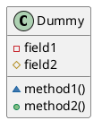
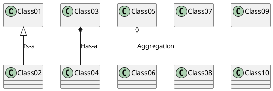
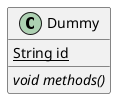
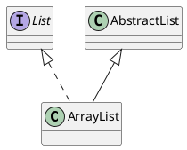

#plantUML

# Class diagram
> https://plantuml.com/class-diagram

## Defining visibility

| **Character** | **Icon for field**                                      | **Icon for method**                                      | **Visibility**    |
| ------------- | ------------------------------------------------------- | -------------------------------------------------------- | ----------------- |
| `-`           |          |          | `private`         |
| `#`           |        |        | `protected`       |
| `~`           |  |  | `package private` |
| `+`           |           |           | `public`          |
```plantUML
@startuml
class Dummy {
 -field1
 #field2
 ~method1()
 +method2() 
}
@enduml
```



## Relations between classes

| **Type**    | **Symbol** | **Drawing**                                 | Relationship         | Example                                                                                 |
| ----------- | ---------- | ------------------------------------------- | -------------------- | --------------------------------------------------------------------------------------- |
| Extension   | `<\|--`    |  | Is-a                 | `Banana` is-a `Fruit`                                                                   |
| Composition | `*--`      |      | Has-a                | `House` has-a `Room`. Rooms don't exists separate to a house                            |
| Aggregation | `o--`      |      | Exists independently | `Student` exists-in `Classroom`. Delete the `Classroom`, and the `Student` still exists |
```plantUML
@startuml
Class01 <|-- Class02 : Is-a
Class03 *-- Class04 : Has-a
Class05 o-- Class06 : Aggregation
Class07 .. Class08
Class09 -- Class10
@enduml
```



---
## Abstract and Static



```plantUML
@startuml
class Dummy {
  {static} String id
  {abstract} void methods()
}
@enduml
```

## Extends and Implements



```plantUML
@startuml
class ArrayList implements List 'Implements'
class ArrayList extends AbstractList 'Extends'
@enduml
```