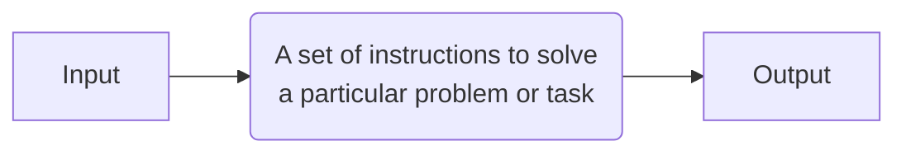
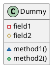
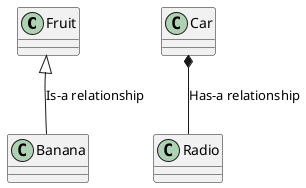

#Java

# Code
- **Code**: A set of instructions written by humans to tell a computer how to perform and complete tasks
	- **Source code**: Human-readable code written in programming languages like `Java`, `C#`, `Python`. Can be compiled into **Machine code** or **Byte code**
	- **Machine code**: Source code can be compiled into Machine code. It is the type of code that the CPU understands
	- **Byte code:** Source code can be compiled into Byte code. It is the type of code that the interpreter JVM (Java Virtual Machine) can convert into Machine code. Interpreted code runs slower than fully compiled code - On the contrary, interpreted code can be platform independent. 
- **Syntax**: The rules that define how the code should be written such as `;` after each line of code
- **Keywords**: Words that cannot be used to name variables `if`, `else`, `void` etc. because they are reserved by already existing variables/methods/classes
- **Expression**: A combination of variables, operators and method calls that results in a single value
	- Arithmetic operations:  `x + y`
	- Assignment operations: `x += 1`
	- Comparison operations: `x == y`
	- Logical operations: `x > y && y > z`
- **Comments**: Code or text that is excluded from being executed during runtime
	- `// Comment example`
- **Pseudocode**: Algorithms that are explained in terms that are readable/understandable without any inherent coding knowledge, syntax or concrete details

```Pseudo-code
1. If time is 6 'o' clock then wake up else keep sleeping
2. Put on clothes
3. Brew some coffee
```

```Pseudo-code
// Mixed code with real language

if (time is 6 'o' clock and sleeping) {
  WakeUp();
}
else {
  KeepSleeping();
}

PutOnSomeClothes();
BrewSomeCoffee();
```

# Variables

- **Declare**: Creating new variables is defined as "declaring" 
	  `int days;` 
- **Initialize**: Assigning values to newly declared variables is defined as "initializing" 
	  `int days = 1;`
- **Assign**: Assigning values to existing variables, or replacing values in existing variables is defined as "assigning" 
	  `days = days + 1;`
- **Scope**: The level at which a variable/method/function can be accessed. Global variables are accessible by everyone and everything, while local variables are constrained to the method/function in which they are created.

```java
// Global variable
int x;

void main() {
  // Local variable
  int y;
}
```

- **Datatype**: A keyword used to determine the kind of data, that your variable can hold

```java
// Primitive datatypes
int myNum = 5;               // Integer (whole number)
float myFloatNum = 5.99f;    // Floating point number
char myLetter = 'D';         // Character
boolean myBool = true;       // Boolean

// Non-primitive datatypes
String myText = "Hello";     // String
```

- **Typecasting**: When you convert a datatype to another `int age = (int)31.5f`

# Logic
- **Operators**: Used to perform mathematical operations
	- Addition: `+`
	- Subtraction: `-` 
	- Multiplication: `*`
	- Subtraction: `/`
- **Conditions**: Used to run parts of the code when certain criteria's are met

```java
if (x > y) {
  System.out.println("x is greater than y");
}
else if (x < y) {
  System.out.println("y is greater than x");
}
else (x == y) {
  System.out.println("x is equal to y");
}
```

- **Evaluate**: Determining the value of an expression or a variable
	- The expression `2 + 2` is evaluated to be `4`
	- The expression `2 == 2` is evaluated to be `true`
	- The variable `displayWidth` is evaluated to be whatever your display width is
- **Boolean expression**: When a `Boolean` value is produced as the result of an expression
	- The expression `4 > 2` is evaluated as `true`
	- The expression `2 > 4` is evaluated as `false`
- **Code block**: A section of code enclosed in curly braces `{}`
- **Logical operators**: Used in boolean expressions to evaluate several, or inverse statements
	- **Logical AND**:  `&&` returns `true` if both statements are true
	- **Logical OR**: `||` returns `true` if one of the statements are true
	- **Logical NOT**: `!` reverses the result. Returns `false` if the result is `true`
- **Algorithm**: A set of instructions to solve a particular problem or task


- **Loop**: A piece of code that is set to run on repeat
	- **For-loop**: `for (int i = 0; i < 10; i++)`
	- **While-loop**: `while(i < 10) { i++; }`
- **Iteration**: A cycle in a repeating loop
	- An n$^{th}$ iteration for-loop: `for (int i = 0; i < n; i++)`
- **Increment**: An increase to a variable's value or an iteration `i++`

# Methods
- **Method/function**: A modular unit of code designed to perform specific tasks

```java
void myGreetingFunction() {
  System.out.println("Hello!")
}
```

- **Method/function call**: Running a method/function by calling its name `myGreetingFunction();`
- **Return type**: The expected output of a method/function. `Void` returns nothing, `int` returns an integer etc.
- **Method signature**: The structure of a method that is designed by the programmer - Usually by returntype, name and its parameter list

```java
// Background signature #1
background(255);

// Background signature #2
background(255,255,255);
```

- **Parameters**: The expected input of a method/function. Parameters act as variables inside the method/function.

```java
// Example with 2 input parameters: 'x' and  'y'
void sum(float x, float y) {
  System.out.println(x + y);
}
```

- **Arguments**: A parameter that is passed to the method is called an argument. An example method call `sum(2, 3)` where `2` and `3` are arguments

# Classes & Objects
- **Class**: A template for objects, e.g. `Fruit`
- **Object/Instance**: An instance of a class, e.g. `Apple, Banana, Mango`.
- **Instantiate**: When an object is created, they inherit all the variables and methods from the class
- **Attribute**: Variables in a object such as `int weight = 100` or `String color = "red"`
- **New**: A keyword used to create an object `Fruit apple = new Fruit()`
- **Constructer**: A special method that is used to initialize objects. The constructor is called when an object of a class is created. The constructor name is _always_ identical to the class name, and has no return return-type.

```java
public class Banana {

	// Constructor
	public Banana(float weight) {}
}

public class Main(String[] args) {
	// You call constructor when you call Banana().
	// This is also where you provide arguments.
	float weight 0.1f;
	Banana b1 = new Banana(weight);
}
```

# Arrays
- **Array**: Used to store multiple values in a single variable `int[] myArray = new int[3]`
- **Double array**: A multi-dimensional array is an array of arrays. Useful when you want to store data as tabular form

```java
int[][] multiArray = { 
  {1, 2, 3},
  {4, 5, 6},
  {7, 8, 9}
}
```

- **Index**: Used to identify each position in the array. `myArray[3]` accesses the third index element in the array.
- **Zero-indexed**: Arrays where the index starts at 0
- **Iterate an array**: To run through an array, one index at a time
- **For-each**: Used to exclusively loop through elements in an array (or other data set)

```java
for (int index : myArray) {
	System.out.println(index)
}
```

- **Length**: An array property that returns the length of the array `println(myArray.length);`
- **Declare array**: Arrays are declared by typing `[]` after the data type `int[] myArray;`
- **Initialize array**: Arrays can be initialized in two ways:
	- An empty array with a predefined array size:  `int[] myArray = new int[10];`
	- With an **array literal**: `int[] myArray = { 1, 2, 3, 4, 5, 6, 7, 8, 9, 10 };`
- **Assign values to array**: You have to specify the index you want to change `myArray[10] = 10;`
- **Use/read a value from an array**: Array values are accessed by index `int myInt = myArray[10];`
- **Dynamic array**: An array that is resizable

```java
import java.util.ArrayList; // import the ArrayList class

ArrayList<String> cars = new ArrayList<String>(); // Create an ArrayList object
cars.add("Audi");
```

# Object Oriented Programming
- **Getter**: Also known as **Accessor**. A method that returns the value of an instance variable
- **Setter**: Also known as **Mutator**: A method that assigns a value to an instance variable
- **toString()**: A method that casts an object to a String.
- **Information hiding**: The practice of making instance variables `private`
- **Shadowing**: Occurs when a local variable of parameter has the same name as an attribute
- **Client**: A class that uses objects defined in another class
- **Override**: Replacing a default implementation of a method

```java
class Fruit {
  private float weight;

  // Constructor
  Fruit() {
    weight = 5;
  }

  // Override constructor
  Fruit(float weight) {
    // Shadowing
    this.weight = weight;
  }

  // Instance methods below

  // Getter (Accessor)
  float getWeight() {
    return weight;
  }

  // Setter (Mutator)
  void setWeight(float weight) {
    this.weight = weight;
  }
}
```

- **Identical**: References to the same object or he same location in memory are identical
- **Equivalent**: Two objects that are "equal", but not necessarily identical, as defined by the `equals` method.

```java
String fruit1 = "Banana";
Fruit fruit2 = fruit1;
Fruit fruit3 = "Banana";

// Identical
System.out.println(fruit1 == fruit2); // TRUE
System.out.println(fruit1 == fruit3); // FALSE

// Equivalent
System.out.println(fruit1.equals(fruit3)); // TRUE
```

- **Static**: A keyword for attributes and methods
	- **Static attributes** are shared across all objects
	- **Static methods** can be accessed without creating an object of the class first

```java
public class Main {
  

  public static void main(String[] args) {
    // Static method invocation
    Printer.myStaticMethod(); // Prints "Static method 0"
    Prtiner.myStaticMethod(); // Prints "Static method 1"

    // Public method invocatoin
    Printer obj = new Printer();
    obj.myPublicMethod();
  }  
}

public class Printer {
  private static int staticPrints = 0;

  public static void myStaticMethod() {
    System.out.println("Static method " + staticPrints);
    staticPrints++;
  }

  public void myPublicMethod() {
    System.out.println("Public method");
  }
}
```

- **Public**: A keyword used as access modifier for classes, attributes, methods and constructors, making them **accessible** by any other class.
- **Private**: A keyword used as access modifier for classes, attributes, methods and constructors, making them **inaccessible** by any other class.
- **UML Diagram**: Unified Modeling Language - A standarized language for visualizing software system designs
	- Class Dummy
	- Private field1
	- Protected field2
	- Private package method1()
	- Public method2()


- **Inheritance**: Design technique used to implement a **Is-a** relationship. This type of relationship is expressed in the code using `extends` keyword
	- `Banana` Is-a `Fruit`

```java
public class Banana extends Fruit {}
```

- **Composition**: Design technique used to implement a **Has-a** relationship. This type of relationship is expressed in the code using variables of an object in another class.
	- `Car` Has-a `Radio`

```java
public class Car {
	private Radio radio = new Radio();
}
```



- **Extends**: Keyword used to inherit from a class `public class Banana extends Fruit`
- **Implements**: Keyword used to implement an interface 
- **Abstract**: Keyword used for classes and methods as non-access modifier
	- **Abstract class**: A restricted class that cannot be used to create objects. It must be inherited from another class
	- **Abstract method**: Can only be used in an abstract class, and does not have a body/implementation. The body is provided by the subclass. 
- **Interface**: A completely abstract class. They are used to achieve security by hiding certain details and only show important details of an object (interface). Classes can implement multiple interfaces, separated by comma.
	- Like abstract classes, interfaces cannot be used to create objects
	- Interface methods do not have a body - the body is provided by the subclass
	- You must override all of its methods
	- Interface methods are by default `abstract` and `public`
	- Interface attributes are by default `public`, `static`, and `final`
	- An interface cannot contain a constructor (as it cannot be used to create objects)
- **Super**: Keyword used to call superclass method and access the superclass constructor
- **Override**: Overloading a superclass method
- **Subclass**: When another class inherits/extends your class. Also known as a child class.
- **Superclass**: When your class inherits/extends another class. Also known as a parent class.
- **Protected**: Access modifier - Allows a subclass to inherit a attribute that is private for the super- and subclass.
- **Static Binding**: When the binding can be resolved at compile time. Also known as early binding. All static, private and final methods are bound at compile-time.
- **Dynamic Binding**: When the compiler doesn't decide the method to be called. Also known as late binding. For example in Overriding, the method is decided at runtime, if the superclass method, or the subclass method should be called.
- **Polymorphism**: From Greek, "Poly" meaning "many" and "morph" meaning "forms". In programming, Polymorphing is the use of inheritance and overriding methods to reshape a superclass.

# Data structures
- **List**: An **ordered** collection of objects in which **duplicate values can be stored** `List<String> list = new ArrayList<>();` 
	- ArrayList is better at storing data
	- LinkedList is better at manipulating data
- **Set**: A collection of objects in which **duplicate values cannot be stored** `Set<String> set = new HashSet<>();`
	- HashSet is unordered, but performs faster
	- TreeSet is ordered using Binary Sort, but performs slower 
- **Map**: A Key/Value pair data structure, where keys are unique identifiers. Instead of calling by index number, Maps are called by their Key:
  
```java
Map<String, String> map = new HashMap<>();  
map.put("MyKey", "MyValue");
System.out.println(map.get("MyKey")); // Prints: MyValue
map.put("MyKey", "MyNewValue");
System.out.println(map.get("MyKey")); // Prints: MyNewValue
```
  
- **Hashing**: A function that maps keys to a hash index. A hash index is the indexes of a Hashtable. The function uses modulus `%` of the Hashtable size to calculate the hash index. The initial size of a Hashtable is 11, unless explicitly specified. 
  
```
hashIndex = key % hashTableSize
```

- **Chain hashing**: When multiple keys have same hash index, the hash index will turn into a Linked List, that can carry multiple keys
- **Hashcode**: A method in Hashtables that returns the primitive integer value represented by the key. If the key is already an integer, it will simply be the same as the key. For other object types, Java will translate the object into an integer
- **O-notation**: A standardized way of comparing efficiency of different algorithms in terms of worst-case performance